# shogiTS
shogiTSはWEB上で将棋を遊べるように開発しているプロジェクトです。  
開発言語は保守性や安全性を考え`TypeScript`を使用しています。  
## リンク
 - 実際の動かしているサイト  
[将棋サイト](https://sanae.tokyo/tools/shogi/)

## プログラム

piece.ts クラス概要

### piece.ts
ここでは将棋の駒に関するクラスを定義しています。 
 - `boardSize`
    ボードサイズ(9*9マス)を格納します。
 - `partition`
    方向が切り替わったことを示す番兵です。 
 - `Position`
    駒の位置(行,列)を格納する型エイリアス`[number][number]`です。
 - `Direction`
    方向を指定することが出来る列挙型です。

 - `Piece`
    各駒の基底クラスです。
    - `public`メンバ
        - `isSente`
            駒の所有者は先手かどうかを格納します。  
            `undefined`の時所有者なしと判定されます。
        - `canPromotion`
            成ることが出来るクラスかを格納します。
        - `changePromotoionStatus():void`
            その駒を成らせます。  
            `canPromotion`が`false|undefined`の時`Error`を`throw`します。
        - `getIsPromoted():boolean`
            成っているかどうかを返します。
        - `setRefusePromotion():boolean`
        成ることを拒否します。  
        すでに拒否されていた場合`Error`を`throw`します。
        - `getRefusedPromotion():boolean`
            成ることを拒否したかどうかを返します。
        - `toString():string`
            駒の表示名を返します。
    - `abstruct`
        - `generateMovePositions`
            各駒が動ける位置を格納した配列を生成します。

    - `protected`メンバ
        - `isPromoted`
            成ったかどうかを格納します。
        - `refusedPromotion`
            成らないことを選択されたかを格納します。
        - `getLinearMovePotirions(Position,number,[Direction,Direction?][],boolean|undefined)`
            その駒が動くことのできる位置を配列で返します。  
            各引数の説明  
            1. 駒の位置`[行番号,列番号]`
            2. 何マス動くか。端まで動ける場合は`boardSize`を指定します。
            3. 方向を示します。
            4. 先手かどうかを指定します。

            `getLinearMovePositions([2, 3], 3, [[Direction.Up], [Direction.Down, Direction.Left]], true);`
            の時3マス上方向と左下に動くことが出来る。
 - `Air`  
    空白のクラスです。  
    `isSente`は`undefined`であり所有者はいません。  
    `toString`は空白を返します。  
    動ける位置を取得しようと`generateMovePositions`を呼び出した場合`Error`を`throw`します。
 - `King`  
    王将のクラスです。  
    `canPromotion`は`false`であり成ることはできません。  
    `toString`は`王`を返します。
    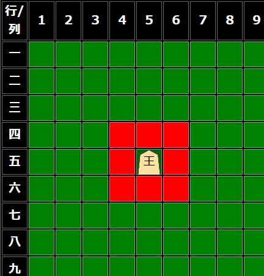
 - `Rook`  
    飛車クラスです。
    `toString`は`飛`を返します。  
    成っている場合は`竜`を返します。
    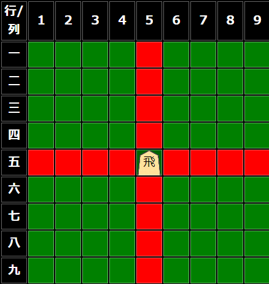
    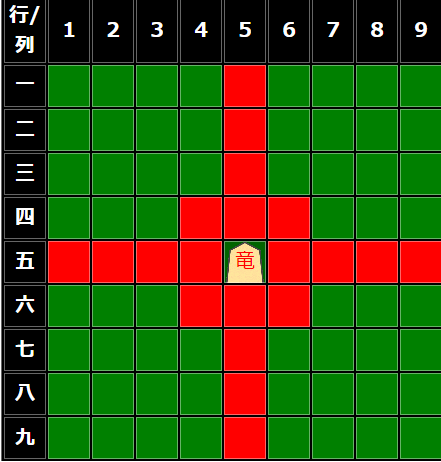
 - `Bishop`  
    角クラスです。
    `toString`は`角`を返します。  
    成っている場合は`龍`を返します。
    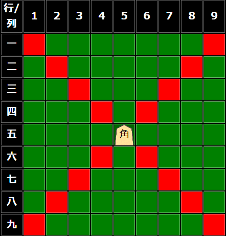
    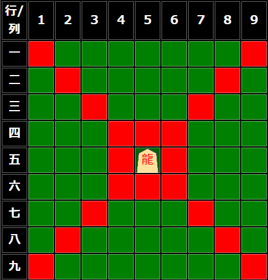
 - `Pawn`
    歩クラスです。    
    `toString`は`歩`を返します。  
    成っている場合は`と`を返します。
    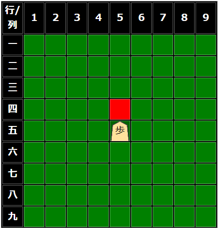
    
 - `Lance`
    香車クラスです。  
    `toString`は`香`を返します。
    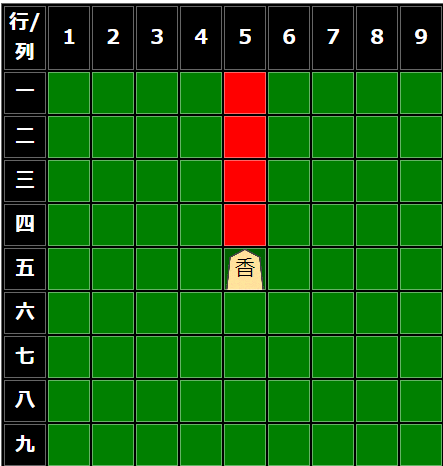
    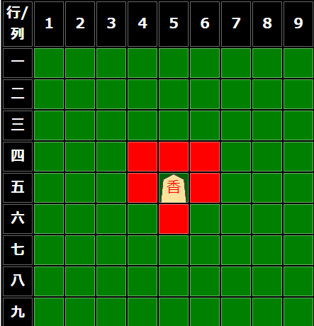
 - `Knight`
    香車クラスです。  
    `toString`は`桂`を返します。
    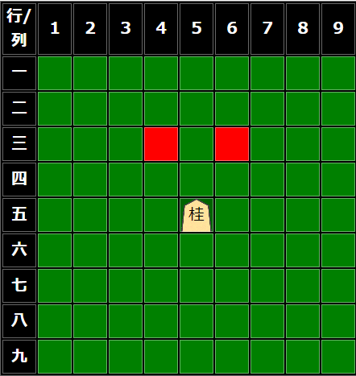
    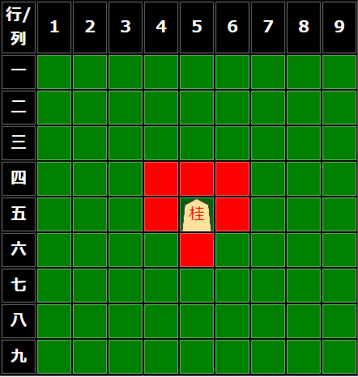
 - `GoldGen`
    金クラスです。
    `canPromotion`は`false`であり成ることはできません。     
    `toString`は`金`を返します。
    
 - `SilverGen`
    銀クラスです。
    `canPromotion`は`false`であり成ることはできません。     
    `toString`は`銀`を返します。
    
    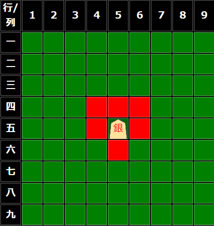

baord.ts クラス概要

### baord.ts
ここでは`Board`クラスを定義しており駒を動かしたりなどの機能を持っています。
- `matrix`
    駒を格納します。初期値はすべて`Air`がセットされます。
- `senteCapturedPieces`
    先手が確保した駒を格納します。初期値は[]です。
- `goteCapturedPieces`
    後手が確保した駒を格納します。初期値は[]です。
- `isSenteTurn`
    現在先手が指す番かを格納します。
- `isPromotionAllowed`
    成るかならないかを質問し`true`または`false`を返す関数です。
- `clearSet`
    すべてを`Air`オブジェクトで埋めます。
- `defaultSet`
    盤面を初期配置にします。
- `move`
    `[fromRow,fromCol]`から`[toRow,toCol]`へ駒を移動させます。  
    成功した時には`true`を返します。  
    動かそうとした駒が自分のでないときや障害物があるなどして移動させれないとき`false`を返します。
- `moveCapturedPiece`
    所持駒を盤面へ移動させます。
    成功時には`true`を、失敗した時`false`を返します。
- `goNext`
    指す番を切り替えます。

## 実際の画像
### 初期配置
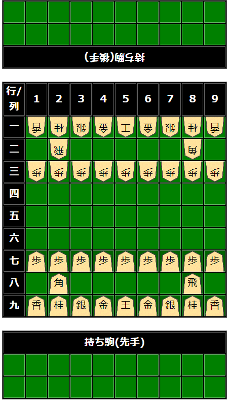
### 動かす
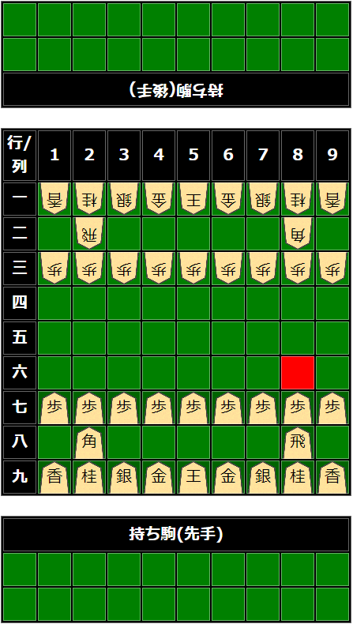
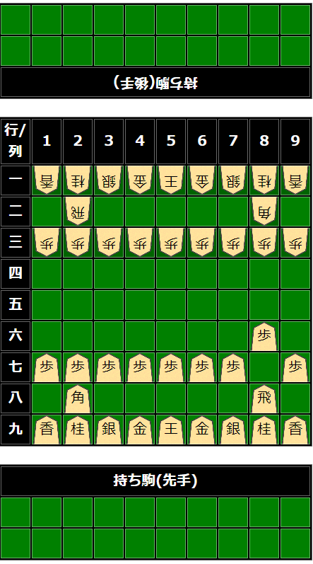

## ライセンス
[MIT License](https://opensource.org/license/mit)
